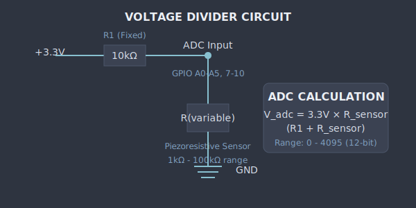

# Smart Socks - Circuit Diagram [DEPRECATED]

**ELEC-E7840 Smart Wearables — Aalto University**

> ⚠️ **DEPRECATED:** This document describes the original 10-sensor (5 per sock) design.
> 
> **Current design:** See [[circuit_diagram_v2]] for the 6-sensor configuration (3 per leg: 2 pressure + 1 stretch).
> 
> **Related:** [[sensor_placement]] | [[sensor_placement_v2]] | [[PLATFORMIO_SETUP]] | [[README]]

---

## System Architecture

> **View Diagram:** Open `diagrams/system_architecture.svg` in your browser
> 
> ```bash
> open 01_Design/diagrams/system_architecture.svg
> ```


### Components

| Component | Description |
|-----------|-------------|
| **Left Sock** | 5 sensors: L_Heel, L_Arch, L_MetaM, L_MetaL, L_Toe |
| **Right Sock** | 5 sensors: R_Heel, R_Arch, R_MetaM, R_MetaL, R_Toe |
| **ESP32S3 XIAO** | 12-bit ADC, 240 MHz, 50 Hz sampling |
| **USB Serial** | Data logging to laptop |
| **WiFi AP** | Web dashboard at 192.168.4.1 |
| **Bluetooth** | BLE wireless streaming |

---

## Voltage Divider Circuit (Per Sensor)

> **View Diagram:** Open `diagrams/voltage_divider.svg` in your browser
>
> ```bash
> open 01_Design/diagrams/voltage_divider.svg
> ```



### Circuit Theory

The piezoresistive fabric sensor acts as a **variable resistor** that changes resistance based on applied pressure:

| Condition | Sensor Resistance | ADC Reading |
|-----------|-------------------|-------------|
| No pressure | ~100 kΩ | ~4000 |
| Light pressure | ~50 kΩ | ~2700 |
| Heavy pressure | ~1 kΩ | ~300 |

**Formula:**
```
V_adc = 3.3V × (R_sensor / (R_fixed + R_sensor))
ADC_value = V_adc / 3.3V × 4095
```

---

## Pinout Diagram

| Function | Pin | GPIO | Notes |
|----------|-----|------|-------|
| **Left Sock** |
| L_Heel | A0 | GPIO 1 | ADC1_CH0 |
| L_Arch | A1 | GPIO 2 | ADC1_CH1 |
| L_MetaM | A2 | GPIO 3 | ADC1_CH2 |
| L_MetaL | A3 | GPIO 4 | ADC1_CH3 |
| L_Toe | A4 | GPIO 5 | ADC1_CH4 |
| **Right Sock** |
| R_Heel | A5 | GPIO 6 | ADC1_CH5 |
| R_Arch | D8 | GPIO 7 | ADC1_CH6 |
| R_MetaM | D9 | GPIO 8 | ADC1_CH7 |
| R_MetaL | D10 | GPIO 9 | ADC1_CH8 |
| R_Toe | — | GPIO 10 | ADC1_CH9 |

---

## Bill of Materials

| Component | Specification | Quantity | Est. Cost |
|-----------|---------------|----------|-----------|
| Microcontroller | ESP32S3 XIAO | 1 | €8 |
| Piezoresistive Fabric | Eeonyx TL-210 | 0.1 m² | €15 |
| Resistors | 10kΩ, 1% | 10 | €1 |
| Conductive Thread | Silver-plated | 5m | €10 |
| Socks | Athletic, size 42-44 | 2 | €10 |
| USB-C Cable | Data capable | 1 | €5 |
| Prototyping Board | Perfboard 5x7cm | 1 | €2 |
| **Total** | | | **~€51** |

---

## PCB Layout (Conceptual)

> **View Diagram:** Open `diagrams/pcb_layout.svg` in your browser
>
> ```bash
> open 01_Design/diagrams/pcb_layout.svg
> ```

Conceptual 2-layer PCB design (50mm × 30mm):
- ESP32S3 module in center
- 10 sensor input pads (top edge)
- USB-C connector (bottom)
- Minimal trace lengths for noise reduction

---

## Wiring Guide

### Step 1: Prepare Sensors
1. Cut piezoresistive fabric into 2cm × 2cm squares (10 pieces)
2. Attach conductive thread to each corner
3. Encapsulate in fabric patches for durability

### Step 2: Connect to ESP32
1. Connect one side of each sensor to 3.3V rail
2. Connect other side to respective GPIO through 10kΩ resistor
3. Connect resistor junction to ADC input
4. Common ground for all sensors

### Step 3: Testing
```bash
# Upload test firmware
pio run --target upload --environment xiao_esp32s3

# Monitor sensor readings
pio device monitor --baud 115200
```

---

## Navigation

| ← Previous | ↑ Up | Next → |
|------------|------|--------|
| — | [[INDEX]] | [[sensor_placement]] |

---

*Last updated: 2026-01-29 · Nordic Design Edition*
