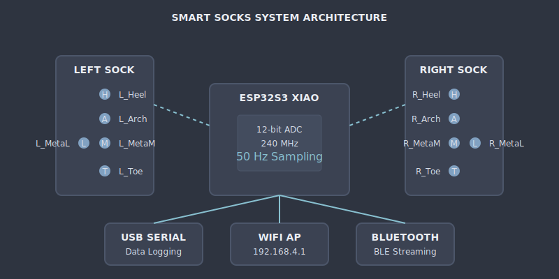
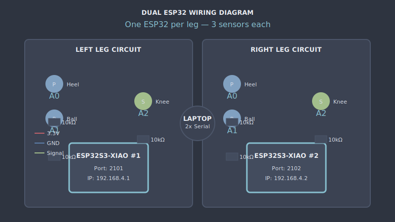

# Smart Socks - Circuit Diagram V2

**ELEC-E7840 Smart Wearables — Aalto University**

> **Updated Design (Jan 2026):** 1 ESP32S3 XIAO reading all 6 sensors (A0-A5)
> 
> **Related:** [[sensor_placement_v2]] | [[PLATFORMIO_SETUP]] | [[PROJECT_STATUS]]

---

## System Architecture

> **View Diagram:** Open `diagrams/system_architecture.svg` in your browser
>
> ```bash
> open 01_Design/diagrams/system_architecture.svg
> open 01_Design/diagrams/dual_esp32_wiring.svg  # Wiring schematic (legacy name)
> ```



### Wiring Schematic



### Single ESP32 Configuration

| Component | Value |
|-----------|-------|
| **MCU** | ESP32S3 XIAO |
| **USB Port** | `/dev/cu.usbmodem2101` |
| **Sensors** | 6 (4 pressure + 2 stretch) |
| **Pins** | A0-A5 |

**Sensor Layout:**
- **Left Leg (A0-A2):** 2 pressure (heel + ball) + 1 stretch (knee)
- **Right Leg (A3-A5):** 2 pressure (heel + ball) + 1 stretch (knee)

---

## Bill of Materials (v2)

### Electronics (for complete system)

| Component | Per Leg | Total Needed | Spare (2x) | Order Qty | Est. Cost |
|-----------|---------|--------------|------------|-----------|-----------|
| **ESP32S3 XIAO** | — | 1 | 1 | **2** | €16 |
| **USB-C Cables** | — | 1 | 1 | **2** | €10 |

### Sensors (with 100% spare for prototyping)

| Sensor Type | Per Leg | System Total | Spare (2x) | Order Qty | Est. Cost |
|-------------|---------|--------------|------------|-----------|-----------|
| **Pressure Sensors** | 2 | 4 | 4 | **8** | €30 |
| **Stretch Sensors** | 1 | 2 | 2 | **4** | €20 |

### Materials per Sensor

| Material | Per Pressure Sensor | Per Stretch Sensor | Total Order |
|----------|---------------------|-------------------|-------------|
| Piezoresistive Fabric | 4cm² | — | 32cm² |
| Conductive Thread | 50cm | 1m | 8m |
| Conductive Fabric (stretch) | — | 10cm × 5cm | 200cm² |

### Passive Components

| Component | Per Leg | System Total | Spare | Order Qty |
|-----------|---------|--------------|-------|-----------|
| 10kΩ Resistors | 3 | 6 | 6 | **12** |
| 100nF Capacitors | 3 | 6 | 6 | **12** |

### Prototyping Materials

| Item | Qty | Est. Cost |
|------|-----|-----------|
| Breadboards (half-size) | 2 | €4 |
| Jumper wires (M-M, assorted) | 1 pack | €3 |
| Jumper wires (M-F, assorted) | 1 pack | €3 |
| Alligator clips (for testing) | 1 pack | €2 |

### Wearables

| Item | Per Leg | System Total | Spare | Order Qty | Est. Cost |
|------|---------|--------------|-------|-----------|-----------|
| Athletic Socks | 1 | 2 | 2 | **4** | €20 |
| Knee Pads (fabric base) | 1 | 2 | 2 | **4** | €16 |
| Elastic Straps | 2m | 4m | 4m | **8m** | €8 |
| Velcro (adhesive) | 1 set | 2 sets | 2 sets | **4 sets** | €6 |

---

## Summary Cost Estimate

| Category | Cost |
|----------|------|
| **Microcontrollers** | €16 |
| **Sensors** | €50 |
| **Materials** | €30 |
| **Prototyping** | €12 |
| **Wearables** | €50 |
| **Total** | **~€148** |

---

## Circuit - All 6 Sensors on One ESP32

```svg
<svg viewBox="0 0 600 350" xmlns="http://www.w3.org/2000/svg">
  <defs>
    <style>
      .bg { fill: #2E3440; }
      .component { fill: none; stroke: #88C0D0; stroke-width: 2; }
      .text { fill: #D8DEE9; font-family: -apple-system, sans-serif; font-size: 12px; }
      .label { fill: #ECEFF4; font-size: 14px; font-weight: bold; }
      .value { fill: #81A1C1; font-size: 11px; }
      .pressure { fill: #81A1C1; }
      .stretch { fill: #A3BE8C; }
    </style>
  </defs>
  
  <rect class="bg" width="600" height="350"/>
  
  <text x="300" y="25" text-anchor="middle" class="label">PER-LEG CIRCUIT (3 Sensors)</text>
  
  <!-- 3.3V Rail -->
  <text x="30" y="60" class="text">+3.3V</text>
  <line class="component" x1="80" y1="60" x2="550" y2="60" stroke-dasharray="5,5"/>
  
  <!-- Pressure Sensor 1 - Heel -->
  <g transform="translate(100, 80)">
    <rect x="0" y="0" width="120" height="80" rx="5" fill="#3B4252" stroke="#81A1C1"/>
    <circle class="pressure" cx="60" cy="30" r="10"/>
    <text x="60" y="35" text-anchor="middle" class="text" fill="#2E3440" font-size="8">P</text>
    <text x="60" y="60" text-anchor="middle" class="text">Heel</text>
    <text x="60" y="75" text-anchor="middle" class="value">→ A0</text>
  </g>
  
  <!-- Pressure Sensor 2 - Ball -->
  <g transform="translate(240, 80)">
    <rect x="0" y="0" width="120" height="80" rx="5" fill="#3B4252" stroke="#81A1C1"/>
    <circle class="pressure" cx="60" cy="30" r="10"/>
    <text x="60" y="35" text-anchor="middle" class="text" fill="#2E3440" font-size="8">P</text>
    <text x="60" y="60" text-anchor="middle" class="text">Ball</text>
    <text x="60" y="75" text-anchor="middle" class="value">→ A1</text>
  </g>
  
  <!-- Stretch Sensor - Knee -->
  <g transform="translate(380, 80)">
    <rect x="0" y="0" width="120" height="80" rx="5" fill="#3B4252" stroke="#A3BE8C"/>
    <circle class="stretch" cx="60" cy="30" r="10"/>
    <text x="60" y="35" text-anchor="middle" class="text" fill="#2E3440" font-size="8">S</text>
    <text x="60" y="60" text-anchor="middle" class="text">Knee</text>
    <text x="60" y="75" text-anchor="middle" class="value">→ A2</text>
  </g>
  
  <!-- Resistors -->
  <g transform="translate(100, 180)">
    <rect x="35" y="0" width="50" height="30" fill="#434C5E" stroke="#4C566A"/>
    <text x="60" y="20" text-anchor="middle" class="text">10kΩ</text>
    <text x="60" y="50" text-anchor="middle" class="value">Voltage Divider</text>
  </g>
  
  <g transform="translate(240, 180)">
    <rect x="35" y="0" width="50" height="30" fill="#434C5E" stroke="#4C566A"/>
    <text x="60" y="20" text-anchor="middle" class="text">10kΩ</text>
    <text x="60" y="50" text-anchor="middle" class="value">Voltage Divider</text>
  </g>
  
  <g transform="translate(380, 180)">
    <rect x="35" y="0" width="50" height="30" fill="#434C5E" stroke="#4C566A"/>
    <text x="60" y="20" text-anchor="middle" class="text">10kΩ</text>
    <text x="60" y="50" text-anchor="middle" class="value">Voltage Divider</text>
  </g>
  
  <!-- GND Rail -->
  <line class="component" x1="80" y1="260" x2="550" y2="260"/>
  <text x="30" y="265" class="text">GND</text>
  
  <!-- ESP32 Label -->
  <g transform="translate(220, 290)">
    <rect x="0" y="0" width="160" height="45" rx="5" fill="#434C5E" stroke="#88C0D0" stroke-width="2"/>
    <text x="80" y="20" text-anchor="middle" class="label" font-size="12">ESP32S3 XIAO</text>
    <text x="80" y="38" text-anchor="middle" class="text">A0, A1, A2 + WiFi</text>
  </g>
</svg>
```

---

## Wiring Guide - Per Leg

### Step 1: Breadboard Setup
1. Place ESP32S3 XIAO on breadboard
2. Connect 3.3V rail to ESP32 3.3V pin
3. Connect GND rail to ESP32 GND pin

### Step 2: Pressure Sensors (Heel + Ball)
```
Sensor Pin 1 ─────┬──── 3.3V
                  │
Sensor Pin 2 ─────┼──── 10kΩ ──┬── A0 (or A1)
                                │
                               GND
```

### Step 3: Stretch Sensor (Knee)
```
Stretch Sensor ───┬──── 3.3V
                  │
                  ├──── 10kΩ ──┬── A2
                  │            │
                  └────────────┘
                               GND
```

### Step 4: Pin Connections

| Sensor | ESP32 Pin | GPIO |
|--------|-----------|------|
| Heel Pressure | A0 | GPIO 1 |
| Ball Pressure | A1 | GPIO 2 |
| Knee Stretch | A2 | GPIO 3 |

---

## Power Considerations

### Per ESP32 Power Draw
- **Active (WiFi + Sampling):** ~100-150mA @ 3.3V
- **Deep Sleep:** ~10μA

### Battery Option
For wireless operation, each leg can use:
- **3.7V LiPo Battery** (500-1000mAh)
- **TP4056 Charging Module**
- **3.3V LDO Regulator** (AMS1117-3.3)

**Estimated Runtime:** 4-6 hours on 500mAh battery

---

## Navigation

| ← Previous | ↑ Up | Next → |
|------------|------|--------|
| — | [[README]] | [[sensor_placement_v2]] |

---

*Last updated: January 2026 · Single ESP32 Edition*
