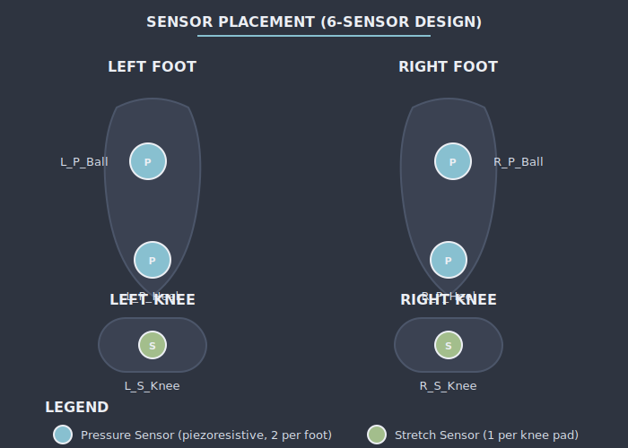

# Smart Socks - Sensor Placement Guide

**ELEC-E7840 Smart Wearables — Aalto University**

> **Related:** [[circuit_diagram]] | [[PLATFORMIO_SETUP]] | [[README]]

---

## Foot Anatomy & Pressure Distribution

> **View Diagram:** Open `diagrams/sensor_placement.svg` in your browser
>
> ```bash
> open 01_Design/diagrams/sensor_placement.svg
> ```



---

## Sensor Zones

### Zone 1: Heel (Calcaneus)
- **Sensor:** L_Heel, R_Heel
- **Function:** Initial contact detection, weight bearing
- **Placement:** Center of heel, slightly towards medial side
- **Expected Signal:** Sharp peak during heel strike

### Zone 2: Arch (Midfoot)
- **Sensor:** L_Arch, R_Arch
- **Function:** Arch collapse detection, stability analysis
- **Placement:** Highest point of arch, navicular bone area
- **Expected Signal:** Gradual increase during stance phase

### Zone 3: Metatarsal Medial (1st MTP)
- **Sensor:** L_MetaM, R_MetaM
- **Function:** Push-off force, balance
- **Placement:** Under big toe joint (ball of foot)
- **Expected Signal:** High during terminal stance

### Zone 4: Metatarsal Lateral (5th MTP)
- **Sensor:** L_MetaL, R_MetaL
- **Function:** Lateral stability, supination/pronation
- **Placement:** Under little toe joint
- **Expected Signal:** Moderate during push-off

### Zone 5: Toe (Hallux)
- **Sensor:** L_Toe, R_Toe
- **Function:** Final propulsion, balance
- **Placement:** Under big toe tip
- **Expected Signal:** Brief high peak at toe-off

---

## Placement Procedure

### Materials Needed
- Fabric marking pencil (washable)
- Ruler or measuring tape
- Sensor templates (2cm × 2cm)
- Iron (for heat-bonding if using adhesive sensors)

### Step-by-Step

1. **Mark Foot Outline**
   - Have subject stand on paper
   - Trace foot outline
   - Mark anatomical landmarks

2. **Locate Key Points**
   ```
   Heel:    2cm from back edge, centered
   Arch:    1/3 distance from heel to ball
   MetaM:   1st metatarsal head (big toe ball)
   MetaL:   5th metatarsal head (little toe ball)
   Toe:     Tip of big toe
   ```

3. **Prepare Sock**
   - Turn sock inside out
   - Mark sensor positions with pencil
   - Verify symmetry between left/right

4. **Attach Sensors**
   - Sew or adhere sensor at marked position
   - Ensure flat contact with skin
   - Reinforce edges to prevent curling

5. **Connect Wiring**
   - Route conductive threads along sock
   - Avoid pressure points
   - Secure with fabric tape

---

## Verification Check

After placement, verify with calibration visualizer:

```bash
python 04_Code/python/calibration_visualizer.py --port /dev/cu.usbmodem2101
```

**Check each sensor:**
- [ ] Heel sensor responds to standing
- [ ] Arch sensor responds to weight shift
- [ ] Metatarsal sensors respond to toe raise
- [ ] Toe sensor responds to walking

---

## Navigation

| ← Previous | ↑ Up | Next → |
|------------|------|--------|
| [[circuit_diagram]] | [[INDEX]] | — |

---

*Last updated: 2026-01-29 · Nordic Design Edition*
